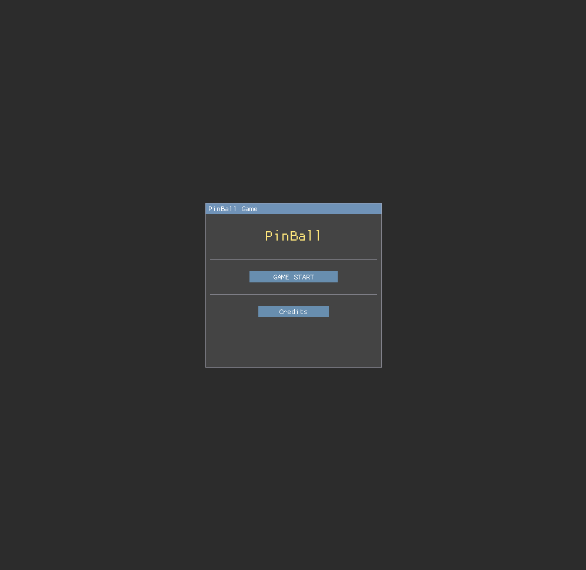
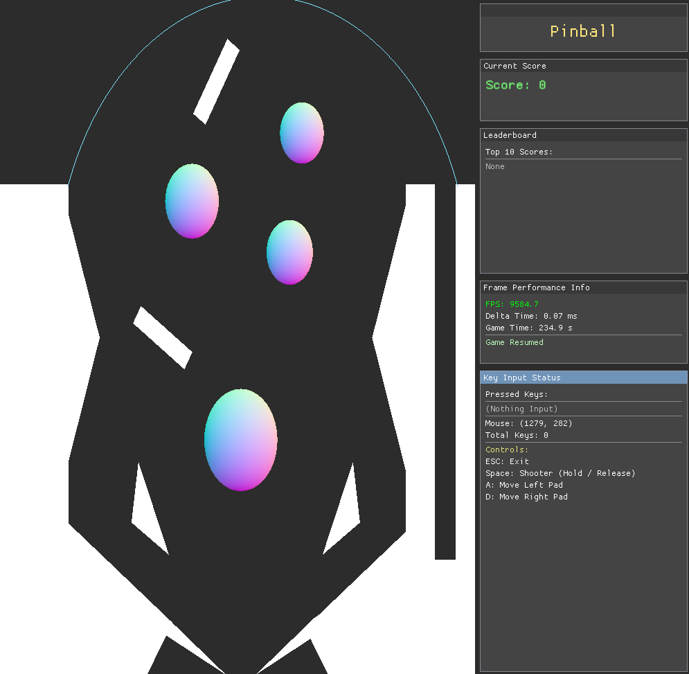

# 🎮 PinBall Game

## 📖 개요
- 크래프톤 정글 게임테크랩 2기 게임잼 산출물 (250902 ~ 250904)
- 클래식한 핀볼 게임을 모던한 C++ / DirectX11 기반으로 재구현한 물리 기반 시뮬레이션 게임
- 실시간 충돌 처리 시스템을 내부적으로 구현하는 것으로 대략적인 구조를 재현하고자 했음

## 🎯 핵심 특징

### 🔧 기술적 특징
- **엔진**: DirectX11 API를 활용한 Custom Engine
- **물리**: 실시간 중력 시뮬레이션 및 충돌 처리
- **렌더링**: HLSL 셰이더 기반 렌더링 파이프라인
- **UI**: ImGui 통합 사용자 인터페이스
- **플랫폼**: Windows (Visual Studio 2022, Jetbrain Rider)

### 🎲 게임 시스템
- **차징 시스템**: 스페이스바를 이용한 발사 파워 조절
- **실시간 점수 시스템**: 충돌 및 시간 기반 점수 산정
- **다양한 충돌체**: 사각형, 삼각형, 원형 (볼록 / 오목) 장애물
- **플리퍼 조작**: A/D 키를 이용한 좌우 플리퍼 제어
- **물리 엔진**: 반발 계수 기반의 게임성을 살린 공 움직임

## 🎮 조작법

| 키 | 기능 |
|---|---|
| `Space` | 차징 (홀드) / 발사 (릴리즈) |
| `A` | 좌측 플리퍼 작동 |
| `D` | 우측 플리퍼 작동 |
| `ESC` | 게임 → 로비 이동 |

## 🎬 플레이 화면

### 메인 로비


*Game Start Button으로 플레이, Credits Button으로 제작자들 리스트 Toggle*

### 게임 플레이 세션


*실제 핀볼을 플레이하는 화면의 UI, Score 및 Leader Board가 존재*

*우측 빈 Line에서 Shooting 된 Ball이 오래 버틸수록 고득점한다*

## 📁 프로젝트 구조

```
game_jam/
├── 📁 Game/                    # 메인 게임 소스코드
│   ├── 📁 Actor/               # 게임 액터 (PinBall, Shooter, Pad)
│   ├── 📁 Manager/             # 시스템 매니저들
│   │   ├── ScoreManager.*     # 점수 관리 시스템
│   │   ├── SceneManager.*     # 씬 전환 시스템
│   │   ├── InputManager.*     # 입력 처리 시스템
│   │   └── TimeManager.*      # 시간 관리 시스템
│   ├── 📁 Scene/              # 게임 씬 (Lobby, Game)
│   ├── 📁 Render/             # DirectX11 렌더링 시스템
│   ├── 📁 Mesh/               # 프리미티브 메시 클래스
│   ├── 📁 Shader/             # HLSL 셰이더 파일
│   └── 📁 UI/                 # UI 시스템
├── 📁 External/                # 외부 라이브러리
│   └── 📁 Library/
│       └── 📁 magic_enum/     # 열거형 리플렉션 라이브러리
├── 📁 Output/                  # 빌드 결과물
│   ├── Game.exe               # 실행 파일
│   └── 📁 Shader/             # 런타임 셰이더 파일
└── 📁 .github/workflows/       # CI/CD 파이프라인
```

## 🏗️ 빌드 방법

### 요구사항
- **OS**: Windows 10/11
- **IDE**: Visual Studio 2022, Jetbrain Rider 25.2
- **Platform Toolset**: v143
- **DirectX**: DirectX 11

### 빌드 단계
1. **저장소 클론**
   ```bash
   git clone <repository-url>
   cd pinball_game
   ```

2. **Visual Studio에서 솔루션 열기**
   ```
   PinBall.sln 파일 실행
   ```

3. **빌드 설정**
   - Configuration: `Debug` 또는 `Release`
   - Platform: `x64`

4. **빌드 실행**
   - `Ctrl + Shift + B` 또는 Build > Build Solution

5. **실행**
   - Output 폴더의 `Game.exe` 실행

### CI/CD
프로젝트는 GitHub Actions를 통한 자동 빌드를 지원합니다:
- **트리거**: `main`, `develop` 브랜치 push / Pull Request
- **플랫폼**: Windows 2022
- **빌드**: Debug, Release 구성 모두 지원

## 🎯 게임 시스템 상세

### 물리 엔진
- **중력**: 실시간 중력 시뮬레이션 (`GRAVITY_ACCELERATION`)
- **충돌**: AABB 충돌 체크 및 각 충돌체에 대응하는 충돌 검출 판정
- **반발**: 재질별 반발계수(`Restitution`) 적용
- **경계**: 화면 경계에서의 벽 반사

### 점수 시스템
- **충돌 점수**: 장애물 충돌 시 `10점`
- **시간 점수**: 매초당 `100점`
- **리더보드**: 최대 10개 기록 저장, 3등까지 색상 차등 표시

### 충돌체 종류
1. **Rectangle**: 회전 가능한 사각형 장애물
2. **Triangle**: 이등변 삼각형 (플리퍼, 범퍼)
3. **ConcaveCircle**: 오목 원형 (경계벽)
4. **ConvexCircle**: 볼록 원형 (범퍼)

## 🛠️ 기술 스택

### 코어 기술
- **언어**: C++17
- **그래픽스**: DirectX 11
- **셰이더**: HLSL 5.0
- **수학**: 자체 구현 Vector/Matrix 연산

### 라이브러리
- **ImGui**: 개발자 UI 및 디버깅
- **magic_enum**: 열거형 리플렉션

### 개발 도구
- **IDE**: Visual Studio 2022, Jetbrain Rider 25.2
- **버전 관리**: Git
- **빌드 시스템**: MSBuild
- **CI/CD**: GitHub Actions

## 🐛 알려진 이슈 및 해결책

### 간헐적 Flipper 오작동 문제
- **문제**: Flipper의 빠른 속도로 인해 Ball을 통과하여 오히려 Ball이 아래로 떨어지는 현상
- **해결**: CCD를 추가해야 하나, 프로젝트 볼륨상 추가하지 않고 세부 조정을 통해 완화

### UTF-8 인코딩
- **설정**: 프로젝트에서 `/utf-8` 컴파일러 옵션 사용으로 빌드 경고 제거

## 🎮 게임플레이 팁

1. **발사 타이밍**: 스페이스바를 길게 눌러 최대 파워로 발사하세요
2. **플리퍼 활용**: A/D 키를 적절히 조합해 공의 방향을 조절하세요
3. **점수 최적화**: 다양한 장애물과 충돌해 높은 점수를 획득하세요
4. **물리 이해**: 공의 속도와 각도를 예측해 전략적으로 플레이하세요

## 🔧 개발자 정보

### 디버그 기능
- **콘솔 출력**: 외부 터미널 On/Off 토글 및 충돌, 점수, 상태 정보 실시간 출력
- **ImGui**: 실시간 파라미터 조정 가능
- **Visual Studio 디버깅**: PDB 파일 포함된 디버그 빌드

## 🚀 개선점

### 향후 개발 계획
- **CCD**: 공 충돌 정밀성 보완
- **사운드 시스템**: Background Sound 및 효과음 추가
- **추가 컨텐츠**:
  - 반탄력이 큰 장애물
  - 들어가면 다른 곳으로 나오는 Hole
  - 추가 Shooter를 통한 상단 장애물 접근 빈도 향상
